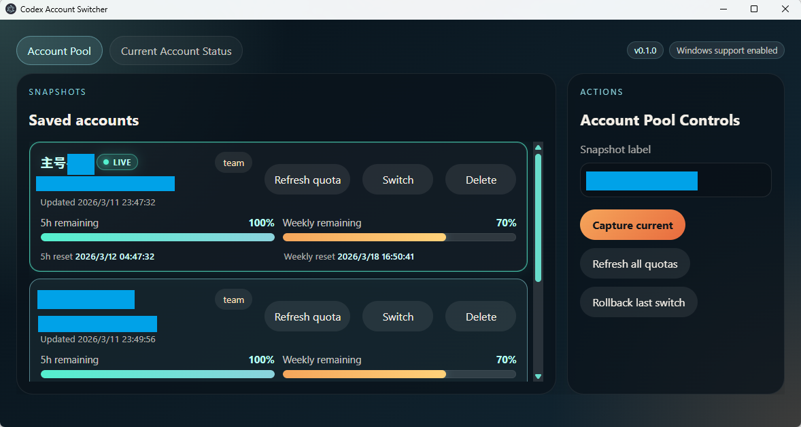

# Codex Desktop Manager

[简体中文](./README.md) | English

A Windows desktop tool for managing multiple local Codex Desktop accounts, snapshots, and quota refresh in one place.

## Screenshot



## What it does

- Capture the current Codex account into a reusable local snapshot
- List saved snapshots and switch between them with one click
- Reuse legacy snapshots and tolerate incomplete snapshot folders
- Back up the live state before switching
- Roll back the previous switch if verification fails
- Show the current live account status from local Codex session data
- Refresh per-snapshot quota using the saved account auth state
- Delete saved local snapshots
- Sort the account pool by practical remaining quota while pinning the current account to the top
- Remember the desktop window size and position between launches

## Workflow

1. First sign in to the account you want to save inside the official Codex Desktop app, and make sure that account can open and run normally.
2. Open `Codex Desktop Manager` and capture the current account so the live login state becomes a reusable local snapshot.
3. If you use multiple accounts, go back to Codex Desktop, sign in to the next account, and repeat the capture flow until the account pool is built.
4. When you want to switch later, click `Switch` on the target account card. The manager will back up the current live state, write the target snapshot, and restart Codex.
5. If post-switch validation fails or the desktop client comes back in a bad state, use `Rollback last switch` to restore the previous backup.
6. When you want a fresh quota read for a saved account, use the refresh action on that account card to re-read the saved auth state.

## Quota behavior

This project uses two different quota sources:

- The current live account page uses locally visible Codex session metadata.
- Saved snapshot quota refresh uses the account auth state saved inside that snapshot to request the Codex usage endpoint.

This is intended to mirror the practical account-switching workflow, not to serve as an official billing dashboard.

## Local state used

The current implementation is centered on:

- `%USERPROFILE%\\.codex\\auth.json`
- `%USERPROFILE%\\.codex\\config.toml`
- `%USERPROFILE%\\.codex\\.codex-global-state.json`
- `%LOCALAPPDATA%\\Codex\\Logs`

Runtime preferences and app-local state such as remembered window size are stored under Electron `userData`, not in the repository.

## Open-source safety

- Do not commit real `auth.json`, tokens, logs, or local snapshots.
- This repository is intended to stay publish-safe; any runtime-sensitive files should remain outside source control.
- Test fixtures use synthetic data only.
- A clean clone can build and open the UI without local Codex auth; quota and account data simply remain unavailable until a real local Codex login exists on that machine.

## Development

```bash
npm install
npm test
npm run build
```

## Run in development

```bash
npm run dev
```

## Current limitations

- Windows only
- Uses local snapshot switching instead of official account APIs
- Codex Desktop storage changes may require adapter updates later

## License

[MIT](./LICENSE)
